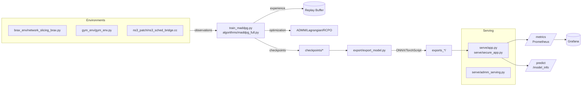
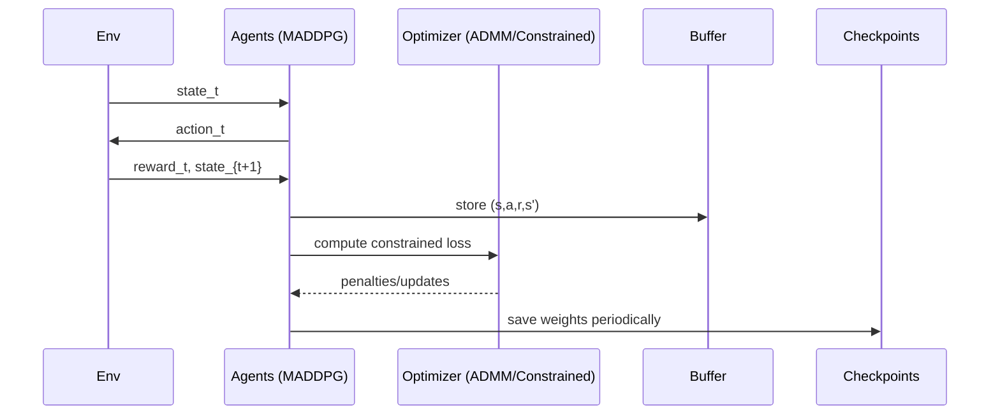

# DeepSlicing: DRL + ADMM for 5G Network Slicing (Research to Production)

[](LICENSE)
[](https://www.python.org/downloads/)
[](https://pytorch.org/)
[](.github/workflows/ci.yml)

DeepSlicing is a production-grade system that learns and serves real-time resource allocations for 5G network slices (eMBB, URLLC, mMTC). It combines multi-agent deep reinforcement learning (MADDPG) with optimization (ADMM) under constraints, with full support for export, secure serving, Docker/Kubernetes deployment, and observability.


## Contents

- Overview
- Architecture (with diagrams)
- Repository Structure
- Quickstart
- Training and Evaluation
- Model Export and Serving
- Deployment (Docker, Kubernetes)
- Monitoring and Operations
- Configuration and Requirements
- Testing
- Documentation Map
- License and Citation


## Overview

5G network slicing requires allocating limited resources across heterogeneous services with distinct QoS targets while traffic is time-varying. DeepSlicing frames this as a constrained multi-agent MDP solved by MADDPG with ADMM-style constraint handling and serving-time guardrails. The project includes:

- Training loop with Brax-like gym-free environment and optional Gym/NS-3 integration
- Constrained RL variations (Lagrangian, RCPO), hierarchical orchestrator, attention critics
- Robustness evaluation across diurnal/burst/outage scenarios
- Export pipelines (PyTorch, ONNX, TorchScript) and quantization for fast inference
- Secure Flask API with metrics, caching hooks, and violation monitoring
- Docker and Kubernetes production manifests with Prometheus/Grafana


## Product Value for Companies

Who will use it
- Mobile operators and private 5G providers: Enforce QoS across slices (eMBB, URLLC, mMTC) and integrate with real 5G cores (e.g., OAI).
- Enterprises with private 5G/edge (manufacturing, logistics, campuses): Guarantee app performance for business-critical services.
- Cloud/telco cloud teams: Operate slicing-as-a-service with observability, autoscaling, and policy control.
- Research testbeds and labs: Run controlled experiments with repeatable deployments.

How it integrates and operates
- Deploy with Docker Compose (dev) and scale with Swarm/Kubernetes (prod); stateless API scales horizontally.
- Plug into 5G cores via the OAI adapter; map SST/SD slice configs and apply QoS targets to NFs.
- Enforce traffic shaping using Linux tc/eBPF via the TC sidecar to realize bandwidth/latency targets.
- Observe and govern with Prometheus, Grafana, Jaeger, API key auth, rate limiting, and secrets.

Typical workflows
- Production rollout: Stand up the stack, configure slices (e.g., eMBB with 100 Mbps), validate health, monitor KPIs (allocation latency, throughput deviation).
- Continuous optimization: Use autoscaling triggers (CPU >70%, P95 latency >10ms) to adjust replicas; run included experiments to tune.
- OAI integration: Launch OAI stack, define slice_configs.json, verify NRF/NF health, and wire DeepSlicing targets to NFs.
- Research validation: Run scaling experiments (3–20 slices), collect QoS/reward stats, and generate CI95 plots.

Business value
- Consistent QoS under load: Keeps target vs actual throughput within ±10% with low allocation latency (<10 ms P95).
- Higher resource efficiency: Dynamic allocation reduces overprovisioning and improves utilization.
- Production-ready from day one: Built-in observability, alerting, security, and safe deployments (blue/green) shorten time-to-value.
- Interoperability and portability: Adapter pattern for 5G cores; containerized for any infrastructure.

Proof points from this repo
- Performance: <10 ms P95 allocation latency; 1000+ requests/sec; ~128 MB memory and 15–25% CPU per instance (per docs).
- Scale & operations: Multi-host deployments with Traefik, Redis, Prometheus, Grafana, Jaeger; node labeling and load-balancing strategies included.
- Security & governance: API keys, rate limiting, network segmentation, and secrets management.

Adoption path
1) Start locally with docker compose for API + monitoring.
2) Move to Linux hosts for real tc/eBPF enforcement and iperf-driven experiments.
3) Integrate with OAI for end-to-end 5G slice validation.
4) Scale with Swarm/K8s using documented autoscaling triggers and dashboards.

Call to action
- Ready to pilot? See research_paper/docs/DEPLOYMENT_PLAYBOOK.md and research_paper/docs/ARCHITECTURE_SCALING.md. For provisioning, see research_paper/provisioning/README.md.

## Targeted Use Cases

Manufacturing (private 5G on factory floor)
- Critical apps: machine vision QA (high-throughput), PLC/robot control (URLLC), AGV telemetry.
- KPIs: P95 control latency <5 ms; camera slice 50–200 Mbps per line; packet loss <0.1%; uptime >99.9%.
- Example steps:
  1) Define slices: URLLC (sst=1, sd=0x000002, 5qi=1), eMBB Cameras (sst=1, sd=0x000001, 5qi=9).
  2) Deploy production stack and enable tc-sidecar on uplink iface.
  3) Set targets via API and monitor Grafana alarms.

Logistics/warehousing (AGVs, scanners, cameras)
- Critical apps: AGV control/telemetry, handheld scanners, CCTV.
- KPIs: AGV control latency <10 ms; scanner slice availability >99.99%; camera streams 10–50 Mbps each; jitter <10 ms.
- Example steps:
  1) Create three slices: URLLC-AGV, BE-Scanners, eMBB-CCTV with documented QoS.
  2) Autoscale API replicas when CPU >70% or P95 latency >10 ms.
  3) Alert on throughput deviation >10% and slice error rates.

Campus/enterprise (voice/video, AR, IT/OT)
- Critical apps: VoIP, video conferencing, AR-assisted maintenance, segmented IT/OT.
- KPIs: Voice MOS >4 (jitter <20 ms, loss <1%); AR round-trip <20 ms; eMBB 100–500 Mbps per group.
- Example steps:
  1) Define slices: Voice (low jitter), Video (bandwidth), AR (low latency), Best-effort IT.
  2) Apply rate limits and RBAC (API keys), and network segmentation.
  3) Track KPIs on Grafana; adjust targets per department policy.

Mobile operator (public 5G, OAI integration)
- Critical apps: multi-tenant slicing across eMBB/URLLC/mMTC; OAI integration.
- KPIs: Allocation latency <10 ms P95; ±10% throughput accuracy; >99.9% availability; 1000+ RPS.
- Example steps:
  1) Deploy OAI and configure slice_configs.json (sst/sd) per research_paper/docs/DEPLOYMENT_PLAYBOOK.md.
  2) Use Traefik, API key auth, rate limiting, and HPA (2–20 replicas).
  3) Federate Prometheus; enable HighLatency and ThroughputDeviation alerts.

## Quick-start API examples by use case

Notes
- Replace {{DS_API_KEY}} with your API key and {{API_BASE}} with your API base URL (e.g., http://localhost:8080).
- The example payload uses POST /allocate with desired slice targets; adjust slice_id and targets to your environment.

Manufacturing (factory floor)

```bash
API_BASE={{API_BASE}}
API_KEY={{DS_API_KEY}}

curl -s -X POST "$API_BASE/allocate" \
  -H "Content-Type: application/json" \
  -H "X-API-Key: $API_KEY" \
  -d '{
        "slices": [
          {"slice_id": 1, "name": "URLLC_Control", "targets": {"latency_ms_p95": 5, "bandwidth_mbps": 5}},
          {"slice_id": 0, "name": "eMBB_Cameras", "targets": {"bandwidth_mbps": 100, "jitter_ms": 5}}
        ]
      }'
```

Logistics/warehousing

```bash
API_BASE={{API_BASE}}
API_KEY={{DS_API_KEY}}

curl -s -X POST "$API_BASE/allocate" \
  -H "Content-Type: application/json" \
  -H "X-API-Key: $API_KEY" \
  -d '{
        "slices": [
          {"slice_id": 1, "name": "AGV_URLLC", "targets": {"latency_ms_p95": 10, "bandwidth_mbps": 5}},
          {"slice_id": 2, "name": "Scanners_BE", "targets": {"availability": 99.99}},
          {"slice_id": 0, "name": "CCTV_eMBB", "targets": {"bandwidth_mbps": 30}}
        ]
      }'
```

Campus/enterprise

```bash
API_BASE={{API_BASE}}
API_KEY={{DS_API_KEY}}

curl -s -X POST "$API_BASE/allocate" \
  -H "Content-Type: application/json" \
  -H "X-API-Key: $API_KEY" \
  -d '{
        "slices": [
          {"slice_id": 10, "name": "Voice", "targets": {"jitter_ms": 20, "loss_pct": 1}},
          {"slice_id": 11, "name": "Video", "targets": {"bandwidth_mbps": 200}},
          {"slice_id": 12, "name": "AR", "targets": {"latency_ms_p95": 20}},
          {"slice_id": 13, "name": "IT_BE", "targets": {"bandwidth_mbps": 50}}
        ]
      }'
```

Mobile operator (public 5G + OAI)

```bash
API_BASE={{API_BASE}}
API_KEY={{DS_API_KEY}}

curl -s -X POST "$API_BASE/allocate" \
  -H "Content-Type: application/json" \
  -H "X-API-Key: $API_KEY" \
  -d '{
        "slices": [
          {"slice_id": 0, "sst": 1, "sd": "0x000001", "name": "eMBB", "targets": {"bandwidth_mbps": 100}},
          {"slice_id": 1, "sst": 1, "sd": "0x000002", "name": "URLLC", "targets": {"latency_ms_p95": 10}},
          {"slice_id": 2, "sst": 1, "sd": "0x000003", "name": "mMTC", "targets": {"availability": 99.9}}
        ]
      }'
```

Grafana dashboards
- A ready-to-import dashboard is included at deploy/grafana/dashboards/deepslicing-usecases.json with variables for common slices above and panels for throughput target vs actual and allocation latency.


## High-level Architecture




## Training/Dataflow Diagram




## Deployment Topology

```mermaid
graph TD
  subgraph Cluster
    API[DeepSlicing API (Gunicorn/Flask)]
    PROM[Prometheus]
    GRAF[Grafana]
  end
  API -- /metrics --> PROM
  PROM -- dashboards --> GRAF
  API -- Ingress/Service --> Users
```


## Repository Structure

```
Deep Slicing Bundle/
├── algorithms/
│   ├── admm_wrapper.py              # ADMM integration utilities
│   ├── maddpg_full.py               # Core MADDPG implementation
│   ├── attn_critics/attn_critic.py  # Attention-based centralized critic (optional)
│   ├── constrained/
│   │   ├── lagrangian.py            # Lagrangian coordinator
│   │   └── rcpo_wrapper.py          # RCPO variant
│   ├── hierarchical/orchestrator.py # Budget orchestrator
│   └── multi_objective/scalarizers.py
├── brax_env/network_slicing_brax.py # Gym-free environment used by default
├── gym_env/gym_env.py               # Gym-based environment (optional)
├── training/constraints.py          # Constraint computations
├── train_maddpg.py                  # Training entrypoint
├── eval/evaluate.py                 # Evaluation entrypoint
├── generate_plots.py                # Plot helpers
├── export/export_model.py           # Export to PyTorch/ONNX/TorchScript
├── inference/quantize.py            # Int8 quantization utilities
├── serve/
│   ├── app.py                       # REST API for serving
│   ├── secure_app.py                # Hardened API version
│   └── admm_serving.py              # Serving-time consensus blending + metrics
├── deploy/
│   ├── Dockerfile                   # Production image
│   ├── docker-compose.yml           # API + Prometheus + Grafana
│   ├── kubernetes/*.yaml            # K8s manifests (deploy, hpa, ingress)
│   ├── grafana/dashboards/*.json    # Prebuilt dashboards
│   └── prometheus.yml               # Scrape config
├── k8s/deployment.yaml              # Alt K8s manifest
├── data/real_traffic_loader.py      # Optional data loader
├── ns3_patch/ns3_sched_bridge.cc    # NS-3 integration patch
├── scripts/*.py                     # Automation and analysis scripts
├── tests/*.py                       # Unit/integration tests
├── requirements.txt
├── docs/
│   ├── COMPREHENSIVE_GUIDE.md
│   ├── ns3_integration.md
│   └── runbook.md
├── PRODUCTION_READY.md              # Production readiness report
├── deploy/deployment_guide.md       # Deployment guide
├── evaluation_results/*             # Saved eval outputs and plots
├── checkpoints*/                    # Multiple experiment series
├── exports_*/                       # Exported artifacts
├── research_paper/                  # Paper sources, figures, and production docs
│   ├── DeepSlicing_Paper.pdf        # Final paper PDF (also Extended version)
│   ├── DeepSlicing_Research_Paper.md# Narrative overview
│   ├── figures/                     # All generated figures (PNG/PDF)
│   ├── docs/                        # Architecture, deployment, validation docs
│   ├── baselines/, robustness/, joint/, scaling/  # Experiment runners
│   ├── experiments/                 # Scripts for extended runs
│   ├── production/                  # Compose stacks for paper e2e
│   ├── dist/                        # Packaged sources and zips
│   ├── slides/                      # Talk slides
│   ├── compile_paper.sh, build_slides.sh
│   └── CITATION.cff, references.bib
└── LICENSE
```


## Quickstart

Prerequisites: Python 3.10+, pip, and optionally Docker/Kubernetes.

```bash
# 1) Create and activate a virtual environment (recommended on macOS)
python3 -m venv .venv && source .venv/bin/activate
python -m pip install --upgrade pip

# 2) Install dependencies
pip install -r requirements.txt

# 3) Train a model (Brax-like env by default)
python train_maddpg.py --num_episodes 1000 --log_dir ./logs_final --checkpoint_dir ./checkpoints_final

# 4) Evaluate
python eval/evaluate.py --checkpoint ./checkpoints_final/latest

# 5) Export for serving
python export/export_model.py --checkpoint ./checkpoints_final/latest --format onnx torchscript

# 6) Run API locally
python serve/app.py --model ./checkpoints_final/latest --port 5000

# 7) Query the API
curl -s -X POST http://localhost:5000/predict \
  -H "Content-Type: application/json" \
  -d '{"state": [/* 3 slices x 6 features = 18 floats */ 0.9,0.8,0.5,0.33,0.1,0.0,  0.7,0.5,0.4,0.33,0.1,0.0,  0.3,0.2,0.1,0.33,0.1,0.0]}' | jq .
```

Notes
- The API expects a flat state vector of length 18 (3 slices × 6 features). See serve/app.py for details.
- For realistic simulation with NS-3, read run.md and docs/ns3_integration.md.


## Training and Evaluation

Training

```bash
# Baseline training
python train_maddpg.py --num_episodes 2000 --max_steps 100 --hidden_size 256

# With constrained RL (Lagrangian) and curriculum
python train_maddpg.py --constrained lagrangian --constraint_target_qos 0.8 \
  --lagrangian_lr 0.01 --curriculum diurnal --time_features

# With attention critic and model-based rollouts
python train_maddpg.py --use_attention_critic --use_dyna --dyna_ratio 0.2
```

Evaluation and Robustness

```bash
# Single scenario
python eval/evaluate.py --checkpoint ./checkpoints_final/latest --scenario burst --num_episodes 200

# Robustness matrix
python scripts/robustness_matrix.py --checkpoint ./checkpoints_final/latest --num_episodes 200
```

Outputs are written to evaluation_results/* and results subfolders created by the scripts.


## Model Export and Serving

Export

```bash
python export/export_model.py --checkpoint ./checkpoints_final/latest --format all
```

Serving (basic)

```bash
python serve/app.py --model ./checkpoints_final/latest
```

Serving with guardrails and quantization

```bash
python serve/app.py --model ./checkpoints_final/latest \
  --admm --admm_rho 0.1 --admm_iterations 3 \
  --qos_threshold 0.8 --reject_violations \
  --quantize --latency_budget_ms 5
```

Key endpoints
- GET /health
- GET /model_info
- GET /metrics (Prometheus JSON; when deployed via docker/k8s use the provided exporter integration)
- POST /predict { state: [float × 18] }


## Deployment

Docker Compose (local stack)

```bash
cd deploy
docker-compose up -d
# API: http://localhost:5000, Prometheus: http://localhost:9090, Grafana: http://localhost:3000
```

Kubernetes (production)

```bash
# Build and push your image
docker build -t your-registry/deepslicing:latest -f deploy/Dockerfile .
docker push your-registry/deepslicing:latest

# Update image in manifests, then apply
kubectl apply -f deploy/kubernetes/deployment.yaml
kubectl apply -f deploy/kubernetes/hpa.yaml
kubectl apply -f deploy/kubernetes/ingress.yaml
```

See deploy/deployment_guide.md for tuning, scaling, and security hardening.


## Monitoring and Operations

- Metrics: /metrics exposes counters, histograms (prediction count/latency, QoS/utilization, ADMM residuals)
- Dashboards: deploy/grafana/dashboards/deepslicing-dashboard.json
- Runbook: docs/runbook.md
- Production readiness report: PRODUCTION_READY.md

Operations quick refs

```bash
# Health
curl http://localhost:5000/health

# Metrics (JSON)
curl http://localhost:5000/metrics | jq .
```


## Configuration and Requirements

- Python: 3.10+ recommended on macOS (see run.md for Apple Silicon tips)
- Install: pip install -r requirements.txt
- Optional NS-3 integration requires separate build; see run.md and docs/ns3_integration.md

Key libraries
- torch>=1.9.0, numpy, pandas, cvxpy, optuna
- flask, gunicorn, prometheus-client, prometheus-flask-exporter
- onnx, onnxruntime (for export)


## Testing

```bash
pytest -q
```

Tests include attention critic, IO invariants for MADDPG, regularization behaviors, scalability and robustness checks.


## Research Paper and Artifacts

The repository includes a complete research paper package under research_paper/ with sources, figures, experiment scripts, and packaged distributions.

Paper workflow

```mermaid
flowchart TD
  SRC[LaTeX sources\nDeepSlicing_Paper.tex] -- compile_paper.sh --\u003e PDF[DeepSlicing_Paper.pdf]
  EXP[experiments/*, baselines/*, robustness/*] -- generate_figures.py --\u003e FIG[figures/*.png, *.pdf]
  FIG --\u003e SRC
  DOCS[docs/*.md (architecture, validation)] --\u003e SRC
  PDF --\u003e DIST[dist/*.zip, *.tar.gz]
```

- Final PDFs: research_paper/DeepSlicing_Paper.pdf, research_paper/DeepSlicing_Extended_Paper.pdf
- Sources: research_paper/*.tex, references.bib, latexmkrc
- Figures: research_paper/figures/*.png|pdf (ADMM flow, convergence, architecture, performance, robustness, scalability, API performance)
- Exec summaries: research_paper/EXECUTIVE_SUMMARY.md, RESULTS_SUMMARY.md, ADDENDUM.md, PAPER_COMPLETION_SUMMARY.md
- Repro runners: research_paper/experiments/*.sh, performance_optimization.py; plus baselines/, robustness/, joint/ runners
- Production stacks for paper validation: research_paper/production/*.yml, scaling/docker-compose.linux-cluster.yml
- Packaging: research_paper/dist/* (ready-to-share archives)

Build locally

```bash
# From research_paper/
./compile_paper.sh
# or use latexmk directly if installed
# latexmk -pdf DeepSlicing_Paper.tex
```

## Reproducibility

This repo contains scripts to reproduce core results and figures used in the paper and dashboards.

- Robustness matrix
  - Runner: research_paper/experiments/variable_targets.sh and scripts/robustness_matrix.py
  - Outputs: evaluation_results/robustness_* (CSV, PNG)
  - Key figure: research_paper/figures/robustness_summary.png
- Scalability
  - Runner: research_paper/scaling/docker-compose.linux-cluster.yml (serving scale) and tests/test_scalability.py
  - Outputs: evaluation_results/*scalability*.csv, .png
  - Key figure: research_paper/figures/scalability_analysis.png
- API performance
  - Runner: scripts/generate_api_performance.py and production stacks under research_paper/production/
  - Outputs: evaluation_results/*api_performance*.csv, .png
  - Key figure: research_paper/figures/api_performance.png
- KPI and summary plots
  - Generators: scripts/generate_kpi_figures.py, scripts/generate_revamped_figures.py, scripts/produce_paper_figures.py
  - Outputs: evaluation_results/evaluation_summary_*.csv|png and research_paper/figures/*.png
  - Example figures: research_paper/figures/evaluation_summary_latest.png, kpi_dashboard.png

To re-run a typical end-to-end evaluation and refresh figures:

```bash
# 1) Evaluate a checkpoint
python eval/evaluate.py --checkpoint ./checkpoints_final/latest --num_episodes 200 --output_dir ./evaluation_results

# 2) Generate KPI plots and summary figures
python scripts/generate_kpi_figures.py --input ./evaluation_results --out ./research_paper/figures

# 3) Assemble paper-ready figures
python scripts/produce_paper_figures.py --results ./evaluation_results --figdir ./research_paper/figures
```

## Documentation Map

- docs/COMPREHENSIVE_GUIDE.md: theoretical formulation, robustness, validation
- deploy/deployment_guide.md: local, Docker, Kubernetes, monitoring, security
- docs/ns3_integration.md and run.md: NS-3 build and integration notes
- PRODUCTION_READY.md: end-to-end production status and metrics
- research_paper/DeepSlicing_Paper.pdf: final manuscript; see also DeepSlicing_Extended_Paper.pdf
- research_paper/DeepSlicing_Research_Paper.md: prose summary aligned with the codebase
- research_paper/docs/*.md: ARCHITECTURE_SCALING.md, DEPLOYMENT_PLAYBOOK.md, REAL_WORLD_VALIDATION.md
- research_paper/figures/: generated figures used in the paper and dashboards
- research_paper/experiments/, baselines/, robustness/, joint/: scripts for reproducing results
- research_paper/compile_paper.sh, latexmkrc: build the LaTeX sources locally


## License

MIT License. See LICENSE.


## Citation

If you use DeepSlicing in academic work, please cite the accompanying paper (update authors/venue):

```
@article{deepslicing2025,
  title   = {DeepSlicing: Deep Reinforcement Learning for Resource Allocation in 5G Network Slicing},
  author  = {Ghosh, S. and collaborators},
  journal = {arXiv/IEEE},
  year    = {2025}
}
```
